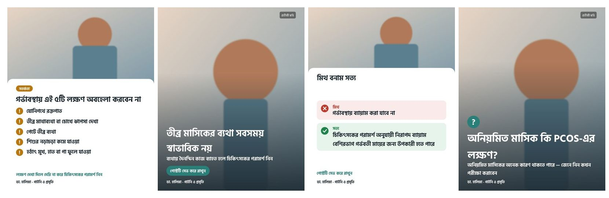
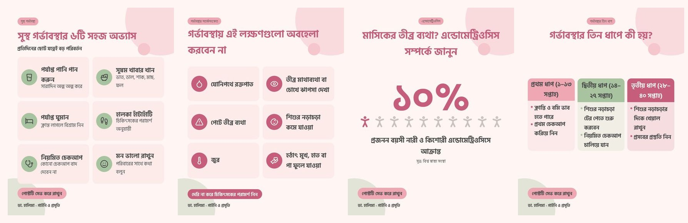

# Image automation — beginner's guide

This system turns an **approved** social-media post into a finished, medically careful, Bangla-language
Facebook image (or carousel). A person approves the image, and the system then hands it to Make.com to post.



*The examples above use a plain test picture in place of the AI photo so you can see the text layouts
(warning list, pain → solution, myth vs fact, question) in Dr. Halima's brand colours.*

---

## 0. Words you will meet (plain-language glossary)

| Word | What it means here |
|---|---|
| **API** | A way for one program to ask another program to do something over the internet. Our code "calls the OpenAI API" to ask OpenAI to draw a picture. |
| **API key** | A secret password that proves the request comes from your OpenAI account (and bills it). Never share it or put it in GitHub. |
| **Environment variable / `.env` file** | Settings stored *outside* the code, e.g. `OPENAI_API_KEY=sk-...`. The file `backend/.env` holds them on your computer. Git ignores it, so secrets never reach GitHub. |
| **JSON** | A simple text format for structured data: `{"topic": "PCOS", "hook": "..."}`. Posts, brand files and metadata are JSON. |
| **Terminal / command line** | The text window where you type commands such as `npm run image -- --post sample-01`. (Windows: "Terminal" or "PowerShell"; Mac: "Terminal".) |
| **npm** | The tool that installs this project's building blocks and runs its commands. It comes with Node.js. |
| **Webhook** | A private web address (URL) belonging to a Make.com scenario. When our program sends data to it, that Make scenario starts. |
| **Endpoint** | One "door" of an API, e.g. `POST /v1/image-jobs` on our backend. |
| **Image pipeline** | The chain of steps from post → decision → prompt → picture → text → review → Make. |
| **Renderer** | The part that draws the Bangla letters onto the picture (here: the `sharp` library with the Hind Siliguri font). |
| **Prompt** | The written instructions sent to the image model ("a Bangladeshi woman in a calm Dhaka clinic…"). |
| **Dry run** | A practice run: everything happens **except** the paid OpenAI call. It's free. |
| **State machine / status** | Each post has exactly one status (e.g. `IMAGE_REVIEW_PENDING`) and may only move to allowed next statuses. That's how we guarantee nothing is published without approval. |
| **Database / storage** | Where data is kept. Here it's simple folders and JSON files in `assets/`. |

---

## 1. What already existed (and what didn't change)

| Part | What it does today | Changed? |
|---|---|---|
| **Live Make.com scenario** "Dr Halima – Daily plan (5 posts/day)" | Every 3 hours (10:00–22:00 Dhaka) it writes one Bangla post with OpenAI, makes a square picture **with no text on it**, and posts it to Facebook automatically. No human review. | **No.** It keeps running exactly as before. |
| **Node.js backend** (`backend/`) | The image pipeline below, the post writer (`npm run content`) and a small API server for them. Not deployed yet; you run it on your computer. The old Google-Sheets daily-run design was removed (it is in git history). | — |

**New:** `backend/src/imaging/` (the image pipeline), `brands/` (business profiles + font), `posts/` (post files incl. 8 samples),
`assets/` (generated images, created automatically, not stored in git), `make/publish-approved.blueprint.json`, and this guide.

### How the new pipeline fits

```
Business profile (brands/dr_halima.json)
  → Approved post (posts/…json, from `npm run content`, or via the API)
  → Decision engine: which of 20 image styles fits? (+ reasons)
  → Image Creative Brief (every visual + text decision, saved)
  → Safety check (approved text only, no invented numbers, no title upgrades)
  → Prompt (16 labelled sections)
  → Free text-fit test on a grey placeholder
  → OpenAI image model → picture WITHOUT text
  → Bangla text drawn on top by our renderer (headline, list, badges, CTA, name, logo)
  → Creative checklist
  → HUMAN REVIEW (approve / regenerate / edit / change type / reject)
  → Make.com webhook → Facebook (now, or at the scheduled time)
```

> **Important decision for you:** today the live Make scenario posts 5 times a day **without** human review, and
> images made by it have no Bangla text. The new pipeline adds review and text, but it only reaches Facebook through a
> **second Make scenario** (the "publisher", §9). The Make Free plan allows 2 active scenarios, so both can run, but
> then the page gets the 5 automatic posts **plus** your reviewed ones. You choose: keep both, turn the automatic one
> off, or later change it to post only approved items. I have not changed anything in your Make account.

---

## 2. Setup — once, about 20 minutes

You can run this on your own Windows/Mac computer. Nothing needs to be "deployed" to try it.

1. **Install Node.js 20 or newer** from <https://nodejs.org> (choose "LTS"). *Verify:* open a terminal and type
   `node --version`. You should see `v20…` or higher.
2. **Get the code.** Either `git clone https://github.com/quickfixstudios/Dr-Halima-Social-Media-Posting-AI-Agent.git`,
   or download the ZIP from GitHub (green **Code** button) and unzip it. Then switch to the branch
   `claude/festive-clarke-ts5hw8` (or the main branch, once this work is merged).
3. **Install the building blocks:** in the terminal go into the backend folder and install:
   ```bash
   cd Dr-Halima-Social-Media-Posting-AI-Agent/backend
   npm install
   ```
   *Verify:* it ends with "added … packages" and no red `ERR!`.
4. **Create your settings file:** copy `backend/.env.example` to `backend/.env` (same folder, new name).
   Windows: `copy .env.example .env` · Mac: `cp .env.example .env`.
5. **Add your OpenAI key** — *where:* <https://platform.openai.com/api-keys> → **Create new secret key**. Copy it
   (starts with `sk-`) and paste it into `backend/.env` on the line `OPENAI_API_KEY=sk-...`.
   *Why:* the image model is billed to your OpenAI account. Use a **new** key (an old one was once exposed
   in an old Make scenario — revoke that one). Also set a monthly budget at
   <https://platform.openai.com/settings/organization/limits>.
   *Note:* OpenAI's image models may require your organisation to be **verified** (Settings → Organization → General).
6. **Check everything works (free):**
   ```bash
   npm test                      # 49 automatic checks — expect "pass 49, fail 0"
   npm run image -- --types      # lists the 20 image styles
   ```

---

## 3. Your first Dr. Halima image — step by step

**Step 1 — free preview (dry run).** Nothing is sent to OpenAI.
```bash
npm run image -- --post sample-02 --dry-run
```
You'll see the chosen style and why, the full prompt, the exact text that will go on the image, the sizes, and a
**preview picture** with a grey box where the AI photo will go:
`assets/_dryrun/dr-halima/sample-02/concept-1.jpg`. Open it and check the Bangla text.
To preview all 8 samples at once: `npm run image -- --samples`.

**Step 2 — make the real image** (costs one image generation):
```bash
npm run image -- --post sample-02
```
Logs look like this:
```
[IMAGE] Post sample-02 — Selected type: Pain → Solution (score 18: …)
[IMAGE] Post sample-02 — Generating creative brief
[IMAGE] Post sample-02 — Prompt generated
[IMAGE] Post sample-02 — Sending request to OpenAI (gpt-image-2.5-sunburst, 1232x1536, quality high)
[IMAGE] Post sample-02 — Image saved (generated/gen-001.png) — cost unknown
[IMAGE] Post sample-02 — Bengali overlay applied → final/final-001.jpg
[IMAGE] Post sample-02 — Creative checklist: ok
[IMAGE] Post sample-02 — Awaiting approval (1 concept). Review with: npm run review
```
*Want options?* Add `--concepts 3` to get up to 3 creative directions (e.g. emotional photo, illustration, doctor
authority visual), ranked, for you to choose from. Each costs one generation.

**Step 3 — review it.**
```bash
npm run review
```
Open **http://localhost:8091** in your browser. ("localhost" = your own computer; nobody else can open it.)
Click the post. You'll see the topic, caption, hook, image type, the image, prompt, headline, CTA, cost, the
checklist and any safety notes, plus the buttons **APPROVE · REGENERATE · EDIT PROMPT · EDIT HEADLINE · CHANGE
IMAGE TYPE · REJECT**. Stop the review screen with **Ctrl + C** in the terminal.

**Step 4 — approve.** Type your name, click **APPROVE**. Status becomes `READY_TO_SCHEDULE`.

**Step 5 — send to Make.com** (after §9 is set up): click **SEND TO MAKE.COM**, or
`npm run image -- --send sample-02`. Status becomes `SENT_TO_MAKE`, and `PUBLISHED` when Make answers with the
Facebook post id.

*Verify it worked:* `npm run image -- --show sample-02` prints the status and file paths; the files are in
`assets/dr-halima/<year>/<month>/sample-02/`.

---

## 3a. Designed infographics (no AI picture, no cost)



Four layouts are complete designs made only from **icons + Bangla text**: no AI picture, so they cost nothing and
can't contain AI mistakes. Icons come from [Lucide](https://lucide.dev) (free, ISC licence); only a curated, medically
neutral set is allowed (`backend/src/imaging/overlay/icons.js`, no pills, syringes or anatomy).

| Layout | Used for | Post fields |
|---|---|---|
| `icon_grid` | tips poster, warning signs, checklist, nutrition, condition awareness (PCOS, endometriosis…) | `items: [{ "icon", "label", "detail" }]` (2–8; icons guessed from the words if missing) |
| `stat_visual` | statistics | one `verified_statistics` entry → big number, 10-figure pictogram, source |
| `stage_columns` | trimesters / stages | `stages: [{ "title", "points": [...] }]` (2–4) |
| `myth_fact_table` | 2–4 myths | `myths: [{ "myth", "fact" }]` |

Samples 09–12 in `posts/dr_halima/samples/` use them: `npm run image -- --post sample-09 --dry-run` gives you the
finished poster for free. Emoji in a hook stay in the caption but are left off images (servers often lack emoji fonts).

`npm run content` now also picks a `visual_format` (tips_poster, warning_grid, condition_awareness, stat_visual,
stage_columns, myth_table, carousel, story_picture) and fills these fields, guided by three finished examples
("few-shot" examples in `prompts/infographic_examples.md`). If any on-image word is not in the caption, the draft
gets a warning.

---

## 3b. The content system: 7 content types (live Make + `npm run content`)

Both the live Make scenario and the backend use **one shared prompt**, `prompts/facebook_post.system.md`
(a test checks that they never drift apart). Every post is pure Bangla and is one of 7 content types:

| Type | What the post does |
|---|---|
| Pain → Solution | names a problem women recognise, then the gentle solution / when to see a doctor |
| Myth vs Fact | 1–4 common beliefs, each with the correct fact (several → a Myth/Fact table image) |
| Educational Carousel | 4–5 numbered steps (a multi-slide carousel in the review pipeline) |
| Emotional Story | a clearly hypothetical "ধরুন…" scenario — never a real patient |
| Data/Statistics | ONE fact from `prompts/verified_facts.json` (WHO, with source links), copied exactly |
| Call-to-Action | invites messages to the page ("ইনবক্সে মেসেজ করুন") — no invented phone numbers, prices or offers |
| Doctor Trust | ডা. হালিমা's own voice sharing a value — no invented stories, patient numbers or achievements |

Caption shape: hook again → 2–4 short lines → 2–3 "✅" points → one soft call to action (📩 message / 📌 save & share)
→ the disclaimer. Hooks stop the scroll with care, not fear.

**Live Make scenario:** the 5 daily posts rotate through all 7 types evenly. Its pictures are warm infographic-style
illustrations **without words**: AI image models still misspell Bangla, and Make posts without review. The hook is
the caption's first line instead.

**Backend drafts (with on-image Bangla text):**
```bash
npm run content -- --type myth_vs_fact     # writes posts/dr_halima/drafts/<id>.json (status: draft)
npm run content -- --approve <id>          # after you have read it
npm run image -- --post <id> --dry-run     # free preview, then without --dry-run for the real image
```
The draft carries everything the image needs (hook, small line, CTA, key points, myths, the verified statistic and
its source). Any English letters in the Bangla text are listed as warnings.

**Verified facts:** before adding a statistic to `prompts/verified_facts.json`, open its source page and check the
exact number; add a `source_url` for every fact. Then copy the new fact line into the live Make prompt too (§9).

---

## 4. Writing your own post file

Create a JSON file in `posts/dr_halima/` (copy a sample). Only four fields are required.

| Field | Required | Meaning |
|---|---|---|
| `post_id` | ✔ | Unique id, letters/digits/`-`/`_` (e.g. `2026-10-05-1`) |
| `topic` | ✔ | Short topic (Bangla) |
| `hook` | ✔ | The scroll-stopping first line — becomes the image headline |
| `caption` | ✔ | Full approved caption (with disclaimer) |
| `content_status` | ✔ to generate | Must be `"approved"` — images are only made for approved content |
| `content_type` | | Strongest hint for the style: `warning`, `myth_vs_fact`, `pain_solution`, `curiosity`, `doctor_authority`, `statistic`, `appointment`, `carousel`, `checklist`, `comparison`, `do_dont`, `timeline`, `pcos`, `menstrual`, `fertility`, `nutrition`, `postpartum`, `newborn`, `emotional`, `educational` |
| `goal` | | `education`, `awareness`, `save`, `share`, `engagement`, `trust`, `conversion` |
| `subtitle`, `cta` | | Second line and call-to-action drawn on the image |
| `key_points` | | List items for infographics/checklists/carousels. If missing, numbered lines (`১.` `২.` …) in the caption are used |
| `myth`, `fact` | | Needed for Myth vs Fact (the fact is never invented) |
| `myths` | | Up to 4 `{ "myth", "fact" }` pairs → a Myth/Fact table image |
| `columns` | | `{ "left": {"title","items"}, "right": {…} }` for Do/Don't and comparisons |
| `slides` | | Explicit carousel slides `[{ "title", "body" }]` |
| `verified_statistics` | | `[{ "value", "label", "source", "source_url" }]` — required for statistic images |
| `hashtags` | | 0–3 hashtags; placed after the signature in the Facebook caption |
| `scheduled_time` | | e.g. `2026-10-05T19:00:00+06:00` — Facebook schedules it (10 min–30 days ahead) |
| `visual_type`, `aspect_ratio` | | Force a style (`--type`) or a format (`4:5`, `1:1`, `9:16`, `1.91:1`) |

---

## 5. How the system decides what image to make

`backend/src/imaging/decision.js` scores all 20 styles for each post, and every score comes with reasons:

* `content_type` matches a style: **+10**
* matching words in the hook (+3 each), topic (+2) or caption (+0.5), Bangla or English, max +7
* `goal` matches: **+2**
* content shape: myth + fact (+8), two columns (+6), verified statistic (+6), hook ends with `?` (+4), 3+ list points (+3)
* missing requirements lower a style (e.g. no statistic −8), **unless** you asked for that style explicitly. Then the
  pipeline stops with a clear reason instead of silently switching style.

The winner becomes an **Image Creative Brief** (saved in `metadata.json`): visual type, concept, emotional tone,
subject, number of people, wardrobe, setting, composition, camera angle, lighting, background, style, realism, colour
direction, brand treatment, graphical elements, headline/subtitle/list/CTA, aspect ratio, sizes, things to avoid,
medical-safety notes, and any flags or halts.

**The 20 styles** (`npm run image -- --types`): Pain → Solution · Myth vs Fact · Educational infographic ·
Educational carousel · Emotional story · Statistics · Appointment/CTA poster · Doctor trust · Warning signs ·
Checklist · Comparison · Do vs Don't · Pregnancy timeline · Menstrual-cycle education · Fertility education ·
PCOS awareness · Pregnancy nutrition · Postpartum education · Newborn/maternal care · Question/curiosity.

**Image style:** Dr. Halima's default look is a **warm illustrated infographic** (flat vector shapes with soft
watercolour texture), set by `"image_style": "illustration"` in the brand file. Use `--concepts 2` to also get a photo
version, or set `"image_style": "photo"`. Drawn people get no "প্রতীকী ছবি" label (only photos do). Fetus/womb
drawings are deliberately never made.

**Bangladeshi context:** every person is described as Bangladeshi with realistic South Asian features. Clothing
rotates between salwar kameez, saree, modern kurti, modest office wear and hijab, and settings rotate between
Dhaka clinic, apartment, bedroom, waiting area and rooftop. That avoids "always traditional" or "always the same".
The lists live in `brands/dr_halima.json` → `visual_context`.

**Too much text?** If a list has more points than fit (e.g. 7 warning signs), the post automatically becomes a
**carousel**: slide 1 = photo + hook, one slide per point, last slide = CTA + name + credentials.

---

## 6. Who draws the Bangla text

### 6.1 The AI draws the whole infographic (default, `IMAGE_TEXT_MODE=model`)

GPT Image draws the finished design — layout, illustrations **and** the Bangla text — like a Canva infographic
(reference style: tips posters, early-signs grids, myth-vs-fact tables, trimester guides).

1. **Layout-first prompt** (`backend/src/imaging/infographicPrompt.js`): style keywords ("clean infographic design,
   medical social media post, minimal modern layout, high whitespace, premium healthcare branding") → the exact layout
   for the post's format (card grid, myth table, trimester cards, big number + figures, poster) → one small
   illustration per card → the brand colours as hex codes → typography → **TEXT TO INCLUDE**: every Bangla line,
   labelled ("Headline: …", "Card 1 label: …") → safety rules → "Designed like a professional Canva medical
   infographic, not AI-generated art."
2. The picture is made at the **final post size** (e.g. 4:5), so nothing is cropped.
3. **Bangla text check** (`textCheck.js`): a vision model transcribes every word *as drawn* (told not to fix
   spelling) and each requested line is compared letter by letter. A wrong vowel sign or conjunct fails the line.
4. If a line is wrong, the image is **regenerated** (up to `IMAGE_TEXT_CHECK_RETRIES`, default 2 extra images) and
   the best attempt is kept. Anything still wrong is listed in the review screen ("Not found as written on the
   image"), and the checklist shows `bangla_text_correct: false`.
5. A person still approves every image — the reader model can misread a letter too.
6. Carousels and real photos keep our own renderer (6.2): one AI picture cannot hold every slide, and a real
   photo must not be redrawn.

**Tested 3 Oct 2026** (`gpt-image-2.5-sunburst`, brand palette): an early-signs grid (9 lines), a 5-row myth table
(13 lines, conjuncts like চিকিৎসকের, নির্ধারিত, দ্বিগুণ) and a trimester guide with Bangla digits (12 lines) — every
line was read back letter-perfect, layout rated 9/10.

### 6.2 Our renderer draws the text (`IMAGE_TEXT_MODE=overlay`)

1. The AI is told: **"Do NOT render any text"**, and to leave calm, empty space where our text goes.
2. Our renderer draws the text with **sharp**, which uses **Pango + HarfBuzz**, the same text-shaping engines web
   browsers use. They join conjuncts (ক্ষ, ন্ত, র্ভ) and vowel signs correctly.
3. We always use the font files in `brands/fonts/` (Hind Siliguri, free OFL licence). The result is identical on any
   computer.
4. Each text box has a target size and a **minimum readable size** (designed for 1080 px wide phones). Text that's
   too long shrinks step by step. If it still doesn't fit, the system **stops with `TEXT_TOO_LONG`** and recommends
   shortening or a carousel. It never crops text and never makes it unreadably small.
5. This fit test runs on a **grey placeholder before paying** for the AI picture (in both modes, so over-long text
   is caught early).
6. Optional: `IMAGE_TEXT_SHORTEN_WITH_LLM=true` lets the text model shorten a too-long headline. The result is marked
   *"derived"* in review so a person confirms it adds nothing new.
7. Designed layouts (icon grid, statistic, trimester columns) need no AI picture at all in this mode — free.

---

## 6b. Brand colours (from `brands/guidelines/dr_halima.pdf`)

The guideline palette is stored in `brands/dr_halima.json` and every colour on an image is one of these
**roles** — nothing else:

| Role (`colors`) | Colour | Used for |
|---|---|---|
| `background` | Warm Ivory #FFF6F3 | panels, slide backgrounds (never pure white) |
| `title` | Deep Rose #C65D7B | headings, emphasis, warning badges, the last carousel slide |
| `text` | Soft Charcoal #4A4A4A | body text (never pure black) |
| `highlight` | Soft Medical Pink #EFA7B3 | number badges, quote mark, accent bars, "?" badge |
| `health` | Sage Green #A8C3A0 | facts, ✓ checks, "do" items, health-tip badges |
| `overlay` | Soft Charcoal (warmed with a little Deep Rose) | dark band that keeps text readable over photos |

**CTA buttons** follow the guideline: *Book appointment* → Deep Rose · *Save post* → Soft Pink · *Health tip*
styles → Sage Green · anything else → Deep Rose. The system decides the kind from the CTA words and the image style.

Safeguards: a colour in the brand file that is **not in the palette is refused** ("avoid too many colours");
tints are only mixes of palette colours; text on any coloured shape is automatically charcoal or ivory, whichever
is more readable (all combinations tested to meet contrast rules). The AI picture is asked for a soft palette of
the same colours and told to avoid bright hot pink, too many colours and the pure-white-and-red hospital look.

---

## 7. How OpenAI is used

* Official `openai` Node SDK (`backend/src/imaging/generator.js`); key from `OPENAI_API_KEY`, only on your computer
  or server, never in logs, metadata or the browser.
* Model names come from settings only: `OPENAI_IMAGE_MODEL` (default `gpt-image-2.5-sunburst`, OpenAI's current
  image model) and `OPENAI_TEXT_MODEL` (optional text shortening).
* The picture is requested in the **shape of the area it fills** (e.g. 1536×800 for the top band of a 4:5 list
  post), so nothing important gets cropped. The final file is exactly 1080×1350 (4:5) / 1080×1080 / 1080×1920 /
  1200×628 (`imaging/formats.js`).
* Retries with growing waits on rate limits (429), timeouts and server errors. **No** retry on bad requests,
  safety rejections, wrong key or "insufficient quota". Timeout: `IMAGE_TIMEOUT_MS`.
* Every call (success or failure) is recorded in `assets/_ledger.jsonl` with model, size, quality, token usage,
  OpenAI **request id** and cost.

---

## 8. Medical safety (what the system refuses to do)

* No images for content that isn't `content_status: "approved"`.
* Every word and **every number** on the image must appear in the approved post (or be a neutral label such as
  "মিথ"/"সত্য"). An unsourced number blocks approval.
* Risky claims are blocked in Bangla and English: "১০০%", "গ্যারান্টি", "নিশ্চিতভাবে সেরে যাবে", medicine
  instructions, doses, diagnoses, fear wording.
* **Titles are never upgraded.** Sample 5 says "গাইনী **বিশেষজ্ঞ**" (specialist). Dr. Halima's real title is
  Medical Officer (FCPS Final Part), so it is **blocked**. Sample 6 shows the corrected wording.
  The list is in `brands/dr_halima.json` → `person.forbidden_titles`.
* **Never invents statistics** (sample 7 → `requires_verified_statistic`) or **contact details**. Appointment
  posters that invite messages to the page ("ইনবক্সে মেসেজ করুন", sample 8) need nothing else; a CTA such as
  "ফোন করুন" without a phone number in the brand file stops with `requires_contact_details`.
* **Never fakes Dr. Halima's face.** Without an approved photo, doctor posts use a non-identifying clinic still-life
  and flag "missing doctor photo". With an approved photo, her **real** photo is used and no AI face is made.
* Images of people carry a small **"প্রতীকী ছবি"** ("symbolic image") label, as Bangladeshi media do, so no
  picture looks like a real patient testimonial.
* The prompt always includes medical-accuracy rules and a "what to avoid" list (no blood, anatomy, fetus images,
  pills, needles, frightening hospital scenes, sexualisation, extra fingers, Western stock-photo look, …), and
  unsafe requests in a prompt are blocked.

---

## 9. Make.com — how approved images reach Facebook

**What is sent.** When you click *Send to Make.com*, the backend POSTs one JSON payload to your Make webhook:

```json
{
  "post_id": "sample-02",
  "business": "dr_halima",
  "platform": "facebook",
  "caption": "…approved caption…\n\n— ডা. হালিমা\nএমবিবিএস (এমএমসি), সিএমইউ (আল্ট্রা)\n…\n\n#মাসিকের_ব্যথা",
  "image_url": "https://res.cloudinary.com/…/sample-02-1.jpg",
  "image_urls": ["…"],
  "images": [{ "filename": "final-001.jpg", "mime": "image/jpeg", "url": "…" }],
  "facebook_photos": [{ "type": "url", "url": "…" }],
  "publish_at": "2026-10-05T13:00:00.000Z",
  "content_type": "pain_solution",
  "visual_type": "pain_solution",
  "scheduled_time": "2026-10-05T19:00:00+06:00",
  "metadata": { "topic": "…", "hook": "…", "headline": "…", "cta": "…", "model": "…", "cost_usd": 0.0, "approved_by": "…", "approved_at": "…" }
}
```

* The caption gets the Bangla signature from the brand file and hashtags **last**, the same house style as the
  live scenario.
* **Scheduling stays outside the image system.** `publish_at` is set when the post has a `scheduled_time` 10 minutes
  to 30 days ahead, and Make passes it to Facebook's own **Publish date**, so Facebook schedules it. Otherwise it's
  posted immediately.
* **Single images** can travel inside the webhook (`images[0].base64`). **Carousels need links**, so set
  `CLOUDINARY_CLOUD_NAME` and `CLOUDINARY_UPLOAD_PRESET` (free Cloudinary account → Settings → Upload → add an
  *unsigned* upload preset).

**Setting up the publisher scenario (6 steps, about 10 minutes).** `make/publish-approved.blueprint.json` is a ready
design, checked with Make's own validator.

1. Make.com → **Scenarios → Create a new scenario** → ⋯ menu → **Import Blueprint** → choose
   `make/publish-approved.blueprint.json`.
2. Click the first module (**Webhooks → Custom webhook**) → **Add** → name it "Dr Halima approved posts" → **Save** →
   **Copy address to clipboard**.
3. Paste that address into `backend/.env`: `MAKE_WEBHOOK_URL_DR_HALIMA=https://hook.eu2.make.com/...`
   (treat it like a password).
4. Check the two **Facebook Pages** modules use the connection **"Dr. Halima"** and the page **Dr. Halima**.
5. Scheduling: **Immediately** (it runs when data arrives). Turn the scenario **ON**.
6. *Verify:* approve a test post, click **Send to Make.com**. In Make → the scenario → **History**, you should see a
   green run, and the post status becomes `PUBLISHED` with the Facebook post id. (Delete the test post on Facebook
   if needed.)

Operations: about 3 per published post (webhook, Facebook, response), small compared to the 1,000/month Free plan.

**Other ways in:** the backend API (needs `BACKEND_API_KEY` as `Authorization: Bearer …`):
`POST /v1/image-jobs` (body `{ "post": {...}, "dry_run": true }`), `POST /v1/image-jobs/action`
(`{ "post_id", "action": "approve" | "regenerate" | … }`), `GET /v1/image-jobs?status=IMAGE_REVIEW_PENDING`.

---

## 10. Statuses (the workflow)

`CONTENT_APPROVED → IMAGE_BRIEF_GENERATED → IMAGE_PROMPT_GENERATED → IMAGE_GENERATED → TEXT_OVERLAY_APPLIED →
IMAGE_REVIEW_PENDING → IMAGE_APPROVED → READY_TO_SCHEDULE → SENT_TO_MAKE → PUBLISHED`

Side statuses: **BLOCKED** (missing info / unsafe content: fix the post, then run again with `--force`),
**FAILED** (technical error: run again with `--force`), **IMAGE_REJECTED**. Sending to Make is impossible before
`READY_TO_SCHEDULE`, and the code refuses any other order. Every change is recorded in `metadata.json → history`.

---

## 11. Regenerating a bad image

Pick a reason. The system changes only what's needed:

| Reason (`--reason`) | What happens | Cost |
|---|---|---|
| `face_looks_fake` | adds "natural unretouched skin, candid, full-frame camera" | 1 image |
| `wrong_ethnicity` | insists on clearly Bangladeshi features and skin tones | 1 image |
| `too_much_text` | removes subtitle, keeps 3 list points | free |
| `too_generic` | asks for a topic-specific local detail, new setting | 1 image |
| `too_dramatic` | calmer, lighter emotion | 1 image |
| `not_professional` | premium healthcare editorial look | 1 image |
| `wrong_composition` | keeps the text area empty, smaller subject | 1 image |
| `wrong_clothing` | next wardrobe option, fully modest | 1 image |
| `poor_medical_context` | setting must clearly and accurately fit the topic | 1 image |
| `needs_more_emotional_impact` | warmer emotion, closer framing | 1 image |
| `needs_stronger_hook` | bigger headline, no subtitle | free |
| `keep_image_change_text` | same picture, your new headline (`--headline "..."`) | free |
| `keep_text_regenerate_background` | same text, new picture | 1 image |

```bash
npm run image -- --regenerate sample-02 --reason face_looks_fake
npm run image -- --edit-headline sample-02 --headline "মাসিকের তীব্র ব্যথা সবসময় স্বাভাবিক নয়"
npm run image -- --edit-prompt sample-02 --prompt "A young woman resting on a sofa with a hot water bottle…"
npm run image -- --change-type sample-02 --type emotional_story
```
Your own headline survives later picture regenerations. Every old file is kept: numbers go up
(`gen-002.png`, `final-003.jpg`), and nothing is overwritten.

---

## 12. The creative checklist ("stop-scroll" check)

For each image the review screen shows ✔/✘ for: `hook_clear`, `mobile_readable`, `visual_subject_clear`,
`text_density_ok`, `brand_consistent`, `content_image_alignment`, `curiosity`, `emotional_relevance`.
It's a simple quality checklist based on the text and the brief. **It does not predict Facebook performance.**
If a major check fails, the image is marked **needs_attention** for you to fix or regenerate.

---

## 13. Files and folders

```
brands/dr_halima.json            business profile (edit this, not the code)
brands/quickfix_studios.json     template for your other business
brands/fonts/                    Bangla font + licence
brands/guidelines/               brand guidelines (Dr. Halima: colours, CTA usage, things to avoid)
posts/dr_halima/samples/         8 sample posts (incl. 3 that test the safety stops)
assets/dr-halima/2026/10/<post>/ source/ (real photos) · generated/ (raw AI pictures) · final/ (with text) · metadata.json
assets/_ledger.jsonl             every image call: model, usage, request id, cost
assets/_dryrun/                  dry-run previews (safe to delete)
backend/config/image-pricing.json   prices for cost tracking (you fill them in)
backend/src/imaging/             the pipeline code (one small file per job)
make/publish-approved.blueprint.json  the Make publisher design
```
`assets/` is not stored in GitHub (it's in `.gitignore`). Back it up yourself if you want to keep old images.

---

## 14. Cost controls

| Setting (`backend/.env`) | Default | Meaning |
|---|---|---|
| `IMAGE_GENERATION_DRY_RUN` | false | `true` = never call OpenAI (whole system in preview mode) |
| `MAX_IMAGE_GENERATIONS_PER_POST` | 6 | stop after this many pictures for one post |
| `MAX_REGENERATIONS` | 3 | stop after this many paid regenerations of one post |
| `DAILY_IMAGE_GENERATION_LIMIT` | 25 | max image calls per day (Dhaka time), failed calls included |
| `DAILY_IMAGE_BUDGET` / `MONTHLY_IMAGE_BUDGET` | empty = off | USD limits |

USD budgets need prices. Copy them from <https://openai.com/api/pricing> into `backend/config/image-pricing.json`.
Until you do, costs show as **"unknown"** (never guessed) and only the count limits apply.
`npm run image -- --usage` shows today's and this month's totals.

---

## 15. Add a new image style later

1. Open `backend/src/imaging/categories.js`.
2. Copy an entry that looks similar, change `id` and `label`, and adjust `triggers` (words and content types that
   should select it), `visual` (what the picture shows) and `text` limits.
3. Pick an existing `layout`: `hook_band`, `list`, `timeline`, `myth_fact`, `myth_fact_table`, `two_column`, `question`,
   `cta_poster`, `doctor_quote`, `stat` or `carousel`. (A brand-new layout means adding one function in
   `overlay/layouts.js`.)
4. `npm test`, then `npm run image -- --post <a post> --type <your id> --dry-run` and look at the preview.

---

## 16. Use the same system for QuickFix Studios (or any business)

1. Fill in `brands/quickfix_studios.json` (name, audience, style, tone, `palette` + colour roles + `cta_colors`,
   logo, contacts, signature, `visual_context`). Copy the structure from `brands/dr_halima.json`. Set `"medical": false` for non-medical businesses (no medical-safety prompt section, no
   "প্রতীকী ছবি" label).
2. Put posts in `posts/quickfix_studios/`.
3. Run with `--business quickfix_studios`, e.g. `npm run image -- --business quickfix_studios --post my-post --dry-run`.
   For the review screen, set `IMAGE_DEFAULT_BUSINESS=quickfix_studios` before `npm run review`.
4. Make: import the publisher blueprint again, connect QuickFix's Facebook page, and put its webhook in
   `MAKE_WEBHOOK_URL_QUICKFIX_STUDIOS`.
5. For QuickFix-specific styles, add categories (§15). The decision engine scores them like the others.

---

## 17. Brand decisions still open (placeholders — please decide)

| Item | Where | Why it matters |
|---|---|---|
| ~~Brand colours~~ | ✅ done — from your brand guidelines (§6b) | |
| **Logo** | put a PNG in `brands/assets/`, set `logo_path` | Drawn in the corner of every image. |
| **Dr. Halima's approved photo** | put it in `brands/assets/`, set `person.photo_path` and `person.photo_approved: true` | Enables real doctor-trust posts; no AI face is ever used for her. |
| **Contact details** | `contact_details` (chamber, phone, days, booking link, WhatsApp, Messenger) | Needed for appointment posters; never invented. |
| **Attribution line** | `person.attribution_bn` (now "ডা. হালিমা · গাইনি ও প্রসূতি") | Shown at the bottom of each image. |
| **Prices** | `backend/config/image-pricing.json` | Real cost tracking and USD budgets. |

---

## 18. Troubleshooting

| Message | Meaning → fix |
|---|---|
| `MISSING_API_KEY` | `OPENAI_API_KEY` missing in `backend/.env` (§2 step 5). |
| `API_AUTH` (401) | Key wrong or revoked → make a new key. |
| `API_FORBIDDEN` (403) | Organisation not verified for image models → verify at platform.openai.com. |
| `API_RATE_LIMIT` (429) | Too many requests or no credit → wait, or add credit / check limits. |
| `API_BAD_REQUEST` | OpenAI refused the prompt (often its safety system) → `--edit-prompt` with a calmer description. |
| `API_TIMEOUT` | Slow response → retried automatically; raise `IMAGE_TIMEOUT_MS` if it repeats. |
| `NO_IMAGE_RETURNED` | OpenAI answered without a picture → run again with `--force`. |
| `CONTENT_NOT_APPROVED` | Set `"content_status": "approved"` once the post text is approved. |
| `TEXT_TOO_LONG` | Shorten the hook/points, use a carousel, or enable `IMAGE_TEXT_SHORTEN_WITH_LLM`. |
| `requires_verified_statistic` / `requires_contact_details` / `requires_myth_and_fact` | Add the missing information to the post or brand file. |
| `title_upgrade` | The text overstates the doctor's title → rephrase. |
| `BUDGET_…` | A cost limit was reached → see §14. |
| `ALREADY_EXISTS` | Use the review actions; for BLOCKED/FAILED posts add `--force`. |
| `MAKE_WEBHOOK_MISSING` | Set `MAKE_WEBHOOK_URL_DR_HALIMA` (§9 step 3). |
| `CAROUSEL_NEEDS_URLS` | Carousels need Cloudinary settings (§9). |
| Bangla shows boxes □ | Font files missing → check `brands/fonts/` and `fonts` in the brand file. |
| Review page "Form expired" | The review screen was restarted → reload the page. |

---

## 19. All settings (`backend/.env`)

| Variable | Purpose |
|---|---|
| `OPENAI_API_KEY` | OpenAI secret key (required for real images) |
| `OPENAI_IMAGE_MODEL`, `OPENAI_TEXT_MODEL` | Model names |
| `IMAGE_MODEL_ARBITRARY_SIZES` | `true` for gpt-image-2 family sizes; `false` for older models |
| `IMAGE_QUALITY`, `IMAGE_TIMEOUT_MS`, `IMAGE_RETRIES` | Image request settings |
| `IMAGE_GENERATION_DRY_RUN` | Global free preview mode |
| `IMAGE_TEXT_MODE` | `model` (default: the AI draws the whole infographic, text read back and checked) or `overlay` (our renderer writes the Bangla) |
| `IMAGE_TEXT_CHECK` | `true` (default) = read AI-drawn Bangla back and compare it letter by letter |
| `IMAGE_TEXT_CHECK_RETRIES` | extra generations while a Bangla line is wrong (default 2) |
| `IMAGE_TEXT_CHECK_THRESHOLD` | how close a line must be to count as correct (default 0.97; 1 = identical) |
| `IMAGE_TEXT_SHORTEN_WITH_LLM` | Allow automatic shortening of long headlines |
| `IMAGE_DEFAULT_BUSINESS` | Business used when `--business` is not given |
| `MAX_IMAGE_GENERATIONS_PER_POST`, `MAX_REGENERATIONS`, `DAILY_IMAGE_GENERATION_LIMIT`, `DAILY_IMAGE_BUDGET`, `MONTHLY_IMAGE_BUDGET` | Cost controls |
| `REVIEW_HOST`, `REVIEW_PORT`, `REVIEW_PASSWORD` | Review screen (password required if not on this computer only) |
| `MAKE_WEBHOOK_URL_DR_HALIMA`, `MAKE_WEBHOOK_URL_QUICKFIX_STUDIOS` | Make publisher webhooks |
| `MAKE_IMAGE_DELIVERY` | `auto`, `url` (Cloudinary) or `base64` |
| `CLOUDINARY_CLOUD_NAME`, `CLOUDINARY_UPLOAD_PRESET` | Image links for Make (needed for carousels) |
| `BRANDS_DIR`, `POSTS_DIR`, `ASSETS_DIR` | Optional folder overrides |
